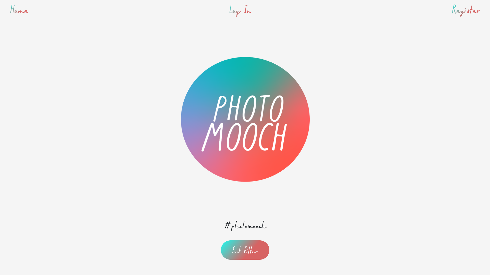

# PhotoMooch

## Web app Photo Mooch - Creative prompts for photographers

Built in collaboration with @photomooch on instagram.
Using creativity and photography to aid mental wellbeing.
This app follows photomooch's aim to provide little creative prompts to spur users on to just get out and have fun playing with photography.
Users can get prompts without an account, however signed in users can save and mark prompts as complete.
Further to this workshop leaders have the option to set up accounts to allow them to add, edit and remove prompts from the database to suit their participants.

Live @ <a href="https://photomooch.onrender.com">PhotoMooch</a>

  

### Build

// BUILD NOTES

Created with a React.js frontend.
Express.js server using mongoose to link to a MongoDB as backend.
Deployed via render.

### Current build notes

Implementing a new prompt generation system utilising OpenAI's GPT-4 API. This will allow for more natural language prompts to be generated, and will allow for more complex prompts to be generated. The AI will be trained on the current prompt database, and will be able to generate prompts based upon which of the five pillars of wellbeing the user wishes to focus on.

Test build is complete, and is currently being tested. Once testing is complete, the new system will be implemented into the main build. This will operate as a seperate system to the current prompt generation system, and will be able to be toggled on and off by the user.

Lots of work arounds / prop drilling in the current build, casing a few niggly bugs. Refactoring to use either context / redux / zustand.

##### Current bug / fix list

**_ On first load have the home page show a pop up explaining how to use the app, and what it is. _**
**_Also need fallback for if server unavailable._**
Fallback for db server error will be to switch to ai generated prompts.

Add user id to completedBy array in prompt documents.

Don't show completed prompts to logged in users.

Odd user handling when manually refreshing page as admin, treats as User not admin?? Also after deleting prompt. (window.refresh?)

404 upon admin updating a prompt? - api logs show no error, but the response is a 404. Need to check front end behaviour.

#### Future Feature / Add-ons

Later progression - Artistic medium based usage (visual prompt, writing prompt, etc)
Build as stand alone app????? // how easy to convert to native???
When adding prompt, push to so that it is the first item in the array, so that it's the first prompt shown to the user.
Also adding prompts tags is lazy/not implemented (just a string input), it needs to be an array of strings.
